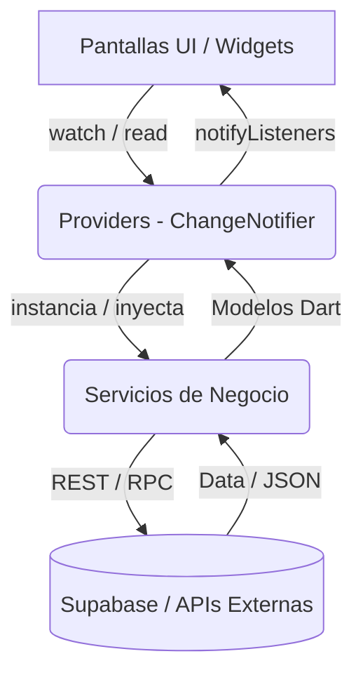

<div align="center">
  

  # Travel Ecuador 🇪🇨
  **Descubre, Comparte y Explora la Belleza del Ecuador**

  
  
  
  
</div>

<br>

**Travel Ecuador** es una aplicación móvil nativa desarrollada con Flutter, diseñada con una arquitectura robusta y escalable. Su propósito es fomentar el turismo interno al permitir a los usuarios descubrir destinos, obtener métricas climatológicas precisas en tiempo real, visualizar mapas y participar en una comunidad impulsada por reseñas y geolocalización.

---

## 📑 Tabla de Contenidos

- [Características Principales](#-características-principales-y-capturas)
- [Arquitectura del Sistema](#-arquitectura-del-sistema)
- [Gestión del Estado y Flujo de Datos](#-gestión-del-estado-y-flujo-de-datos)
- [Integraciones y APIs](#-integraciones-y-apis)
- [Estructura del Proyecto](#-estructura-del-proyecto)
- [Decisiones de Diseño y UI/UX](#-decisiones-de-diseño-y-uiux)
- [Instalación y Configuración](#-instalación-y-configuración)
- [Roadmap](#-roadmap)

---

## 📸 Características Principales y Capturas


<div align="center">
  <!-- Reemplaza con las rutas de tus capturas -->
  

  

  

  

</div>
<br>
<div align="center">
  
  
  
  


</div>

### ✨ Funcionalidades Core
- **Autenticación Segura:** Sistema de login/registro gestionado a través de Supabase Auth con perfiles persistentes.
- **Geolocalización Inversa y Directa:** Integración de OpenStreetMap y Komoot Photon para la creación de destinos con autocompletado y auto-geocoding con `debounce`.
- **Clima en Tiempo Real:** Consumo de la API de OpenWeatherMap inyectada dinámicamente según la lat/lng del lugar.
- **Exploración Contextual:** Modo "Cerca de mí" que cruza el GPS del dispositivo con la API Overpass (OSM) para sugerir POIs (Puntos de Interés) turísticos reales a 5km a la redonda.
- **Asistente Virtual:** `EcuGuía`, un chatbot integrado mediante webview con puente JS (Botpress), orientado a asistencia turística.
- **Paginación Dinámica:** Scroll infinito controlado (`ScrollController`) que carga lotes de 20 destinos optimizando el uso de memoria.

---

## 🏗 Arquitectura del Sistema

El proyecto implementa el patrón arquitectónico **Service - Provider - Screen**, asegurando una estricta separación de responsabilidades, alta testabilidad y escalabilidad.



- **Servicios (`/services`):** Clases Dart puras, agnósticas a la UI. Manejan la lógica de negocio, manejo de excepciones de red, y llamadas a base de datos o APIs REST.
- **Providers (`/providers`):** Gestionan el estado reactivo. Registrados globalmente en el `MultiProvider`. No contienen lógica de negocio compleja, actúan como intermediarios (View-Models).
- **Pantallas (`/screens`):** Estrictamente declarativas. Reaccionan a los cambios de estado y delegan las acciones del usuario a los providers.

---

## 🧠 Gestión del Estado y Flujo de Datos

Se eligió **Provider** (`ChangeNotifier`) por ser una solución pragmática y madura en el ecosistema Flutter. 

### Patrones Destacados:
1. **Manejo Eficiente de Caché:** `VisitaService._actualizarCache()` actualiza el promedio de calificaciones directamente en la tabla `destinos` de Postgres, evitando costosos `JOINs` al cargar listas grandes.
2. **Cross-Screen Refreshing:** Para evitar bucles infinitos (`setState` o `watch` cruzados), se implementó un notificador ligero de control de versiones (`DestinoUpdateNotifier`). Cuando se edita o elimina un destino, este notificador actualiza su versión, invalidando caché selectivamente en el `HomeScreen` y `FavoritesScreen`.
3. **Preservación de Estado de Navegación:** El enrutamiento principal utiliza un `IndexedStack` dentro del `MainTabsScreen`. Esto asegura que los filtros activos, el estado del scroll y el modo "Cerca de Mí" no se pierdan al cambiar de pestañas.

---

## 🔌 Integraciones y APIs

El ecosistema de la app se alimenta de múltiples fuentes de datos:

| Servicio/API | Función Técnica | Implementación / Detalles |
|---|---|---|
| **Supabase** | Backend as a Service | `Auth`, `Postgres` (CRUD con RLS policies) y `Storage` (Buckets separados para avatars e imágenes de destinos). |
| **OpenWeatherMap** | Meteorología | Consultas REST paramétricas (métrico, lang=es). Implementa timeout riguroso de 15s. |
| **Photon (OSM)** | Geocodificación | Traducción Nombre -> Lat/Lng. Estrategia de fallback dinámico si falla la región principal. |
| **Overpass API** | Búsqueda Geoespacial | Queries QL para nodos de tipo `tourism` en radio `haversine` de 5km desde la posición del dispositivo. |
| **Botpress** | NLU / Chatbot | Embebido vía `webview_flutter` utilizando un canal asíncrono JavaScript (Bridge) para escuchar eventos del DOM. |

---

## 📁 Estructura del Proyecto

El código fuente en `lib/` está organizado por capas lógicas (Feature-by-Layer):

```text
lib/
├── models/             # DTOs y Modelos de Dominio con factorías (fromJson/toJson).
├── providers/          # ChangeNotifiers (Session, Visitas, Favoritos, UpdateNotifier).
├── screens/            # UI Controllers.
│   ├── auth/           # (Lógica de autenticación y Gatekeepers).
│   └── dashboard/      # (Gráficos FlChart, estadísticas).
├── services/           # Lógica Core e infraestructura.
│   ├── api/            # Wrappers de OWM, Photon, Overpass.
│   ├── core/           # AuthService, GpsService.
│   └── database/       # Supabase CRUDs.
├── theme/              # AppTheme, Material 3, Sistema de Tokens (AppColors).
├── utils/              # Math utilities, Haversine distances, Caching strategies.
└── widgets/            # Componentes granulares (DestinoCard, ResumenClima).
```

---

## 🎨 Decisiones de Diseño y UI/UX

Actuando bajo estrictas guías de diseño moderno y rendimiento:

1. **Material Design 3:** Implementación completa de MD3. Las tarjetas, chips, y modales (`BottomSheet`) respetan las elevaciones y tipografías nativas.
2. **Paleta de Colores Inmutable (`AppColors`):** Se descartó la generación dinámica vía `ColorScheme.fromSeed` en favor de tokens de color estrictos, garantizando accesibilidad y coherencia (sin tintes morados accidentales).
3. **Manejo Centralizado de Errores:** Se desarrolló un `SnackbarService` que atrapa `AuthException`, `PostgrestException`, y timeouts, traduciéndolos a mensajes amigables para el usuario (User-facing errors).
4. **Debouncing en Búsquedas:** Los campos predictivos (Auto-Geocoding) implementan un *debounce* de 800ms. Esto evita saturar las APIs de Photon/OWM mientras el usuario tipea.
5. **Animaciones Nativas:** La pantalla de carga (`splash_screen`) utiliza el `TickerProviderStateMixin` para secuencias animadas (Scale, Fade, Slide) a 60fps constantes.

---

## ⚙️ Instalación y Configuración

Sigue estos pasos para compilar el proyecto en un entorno local.

### Prerrequisitos
- Flutter SDK `^3.12.1` o superior.
- Dispositivo físico o Emulador Android/iOS.
- (Opcional) Instancia propia de Supabase y API Key de OWM si deseas migrar el backend.

### Pasos de compilación

1. **Clonar el repositorio:**
   ```bash
   git clone https://github.com/tu-usuario/travel_ecuador.git
   cd travel_ecuador
   ```

2. **Instalar dependencias de Dart:**
   ```bash
   flutter pub get
   ```

3. **Análisis de código (Linter):**
   Asegúrate de que la arquitectura cumpla con las reglas:
   ```bash
   flutter analyze
   ```

4. **Ejecutar en modo Debug:**
   ```bash
   flutter run
   ```

*(Recomendación Senior: Para compilar un release optimizado en Android, utiliza `flutter build apk --split-per-abi --obfuscate --split-debug-info=./debug_info`)*.

---

## 🚀 Roadmap (Próximas Mejoras)
- [ ] **Soporte Offline-First:** Implementar `Isar` o `Hive` Database para almacenar en caché destinos visitados y soportar exploración sin red.
- [ ] **Migración a Riverpod:** Refactorización gradual del árbol de dependencias para usar `Riverpod` o `Bloc` de cara a un mayor volumen de estado inmutable.
- [ ] **Animaciones Hero Mejoradas:** Transiciones más complejas entre `DestinoCard` y el `DestinoDetailScreen`.
- [ ] **Testing:** Implementación de Integration Tests (`integration_test`) automatizados para el flujo crítico (Login -> Explorar -> Calificar).

---
*Desarrollado con ❤️ y Flutter.*
